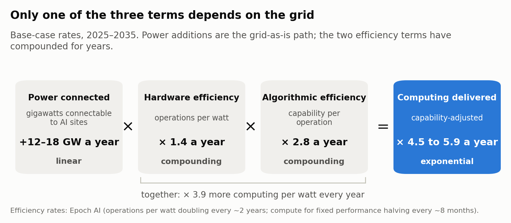
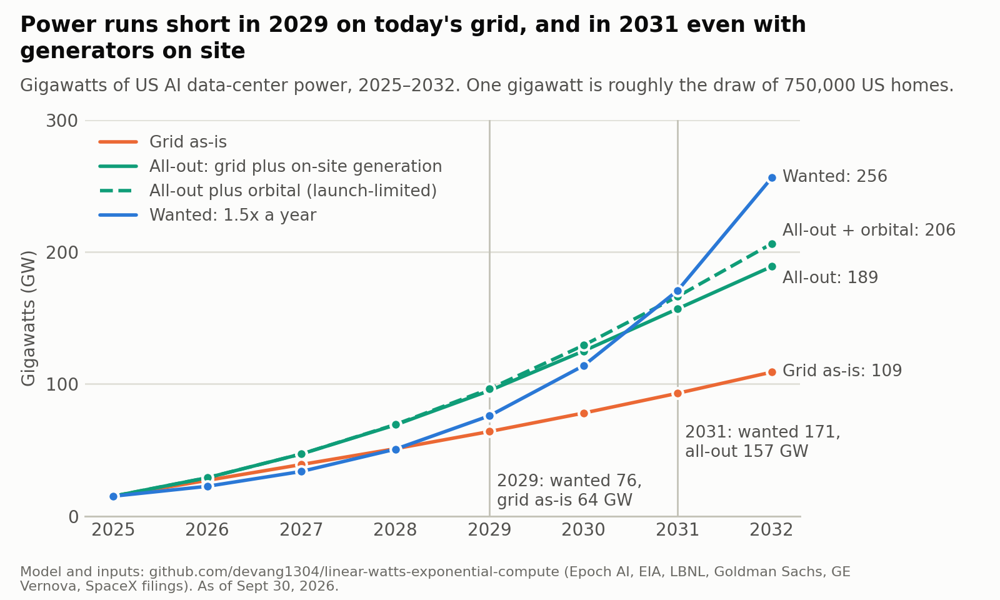
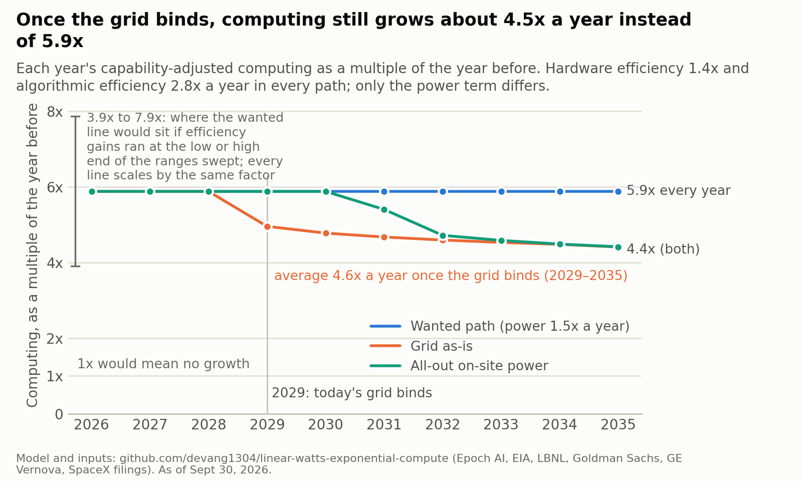
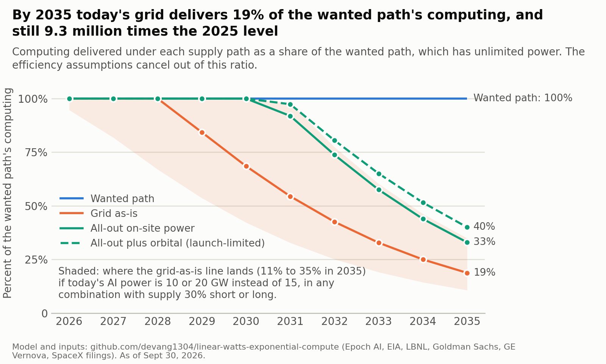
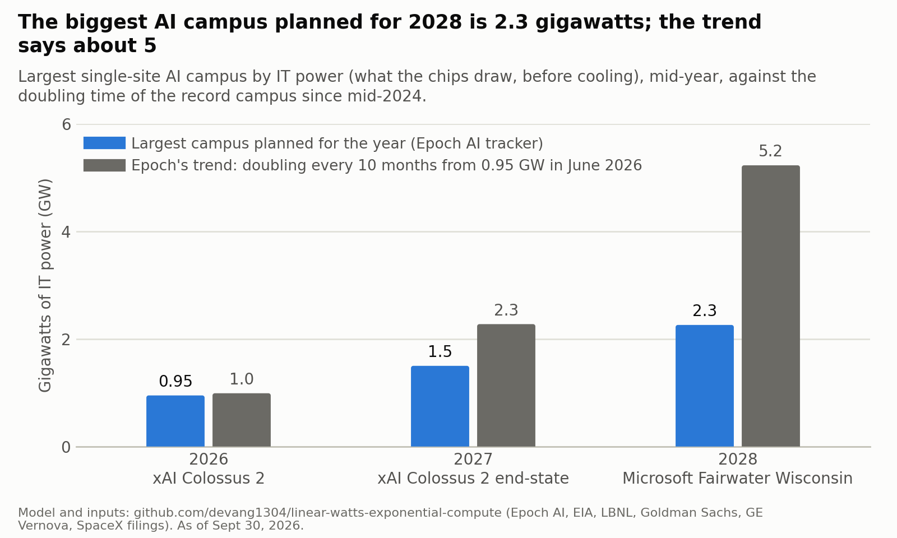
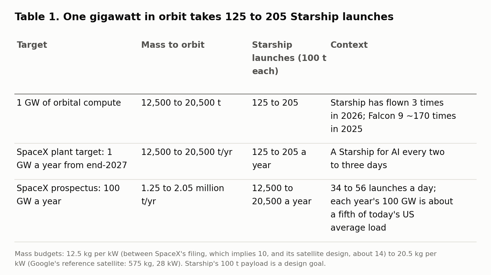
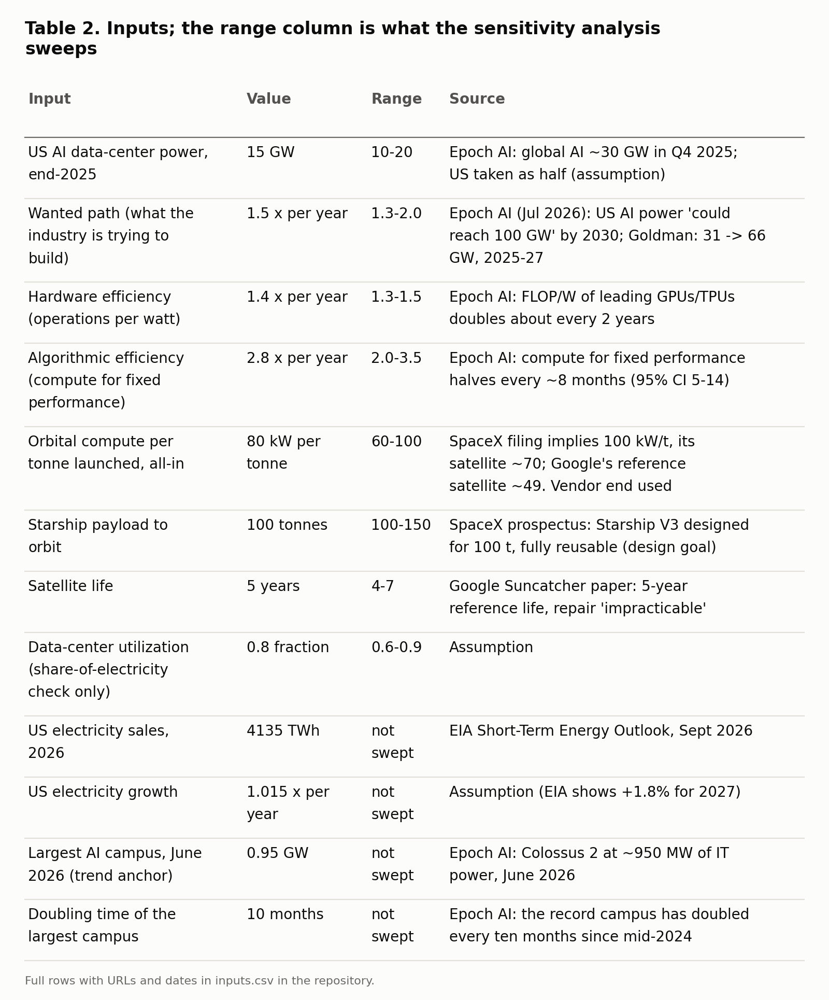
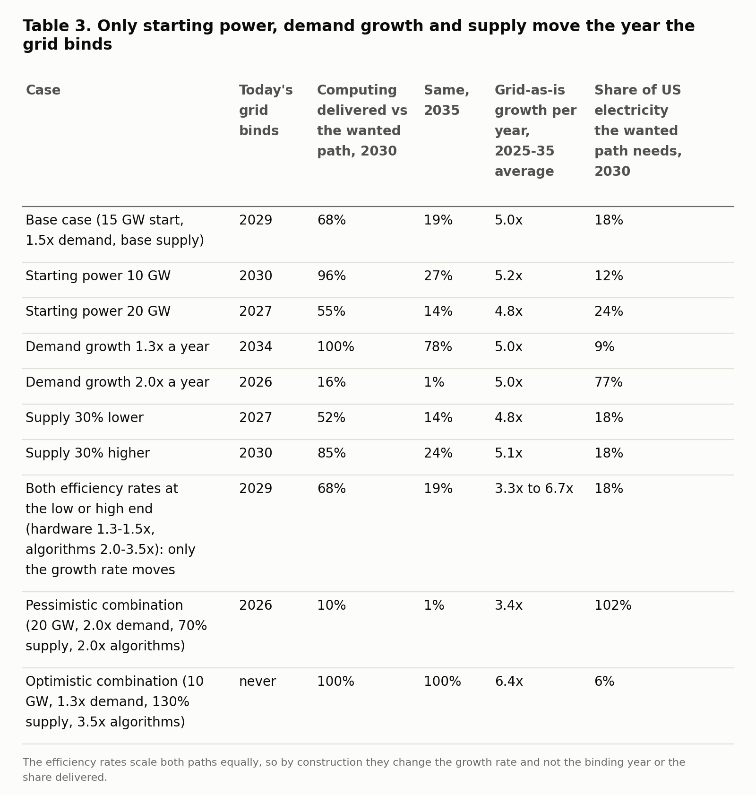

# Linear watts, exponential compute

## Why AI keeps growing exponentially on a power grid that grows a few percent a year, and the one place where it doesn't

On September 28 a Starship reached orbit for the first time. Google's first test satellite carrying AI chips was due to launch on October 1. SpaceX's stock-market filing, from June, talks about putting 100 gigawatts of computing into orbit every year; a gigawatt is roughly the draw of 750,000 American homes. All three are electricity stories. The people building AI have said in public that the thing most likely to stop them is a wall socket.

So does AI run out of electricity? Not in the way the question assumes. Around 2029 the US grid stops keeping up with what the industry wants to build, and AI keeps growing anyway, because most of its exponential was never in the grid. I built a small model to check that claim with numbers, and the answer comes in three of them.

**About 4.5x a year instead of 5.9x.** Suppose the power available to US AI data centers grows in a straight line, 12 to 18 gigawatts a year, against the 50% a year the industry wants. Even then, capability-adjusted computing (chip operations, credited for software gains) still grows about 4.5 times a year once the grid binds, meaning once the industry wants more power than can be connected: 4.6 on average from 2029 to 2035, easing to 4.4, against 5.9 with unlimited power. Electricity dilutes the exponential. It does not stop it.

**2.3 gigawatts instead of 5.** The largest single AI campus planned for 2028 is 2.3 gigawatts. On the trend of the past two years it would be about 5. Nationally, electricity is not yet the limit; at the single site, the plans for 2027 and 2028 already fall behind the curve.

**125 to 205 rocket launches per gigawatt.** Putting one gigawatt of computing in orbit takes 125 Starship flights on SpaceX's numbers and 205 on Google's, and at today's launch prices the launch alone costs 3 to 23 times a data center's electricity bill. Space is a 2030s option, not an answer to the crunch of 2029 to 2031.

The rest of this post shows where those numbers come from, what would change them, and what they mean if you build, buy or pay for electricity.

*September 30, 2026. Every input traces to a source or to a stated assumption. The model behind the post is about 150 lines of Python at [github.com/devang1304/linear-watts-exponential-compute](https://github.com/devang1304/linear-watts-exponential-compute); change any input and rerun it.*

## How electricity became the question

For most of this decade the thing in short supply kept changing: the chips themselves in 2023 and 2024, then the high-bandwidth memory and the packaging that go with them in 2025. By late 2025 the people who run the largest computing fleets had a new answer. "[The biggest issue we are now having is not a compute glut, but it's power,](https://www.techspot.com/news/110118-microsoft-satya-nadella-power-not-chips-now-biggest.html)" Microsoft's Satya Nadella said in November. In February, Elon Musk predicted that by the end of this year "[the chips are going to be piling up and won't be able to be turned on.](https://www.dwarkesh.com/p/elon-musk)" In March, Nvidia's Jensen Huang: "[A 1 gigawatt factory will never become 2. It's physically constrained.](https://www.investing.com/news/transcripts/nvidia-at-gtc-2026-ai-expansion-and-strategic-partnerships-93CH-4564073)"

US electricity sales grow about 1.5 to 2% a year. GE Vernova, the largest maker of big gas turbines, has [116 gigawatts](https://www.gevernova.com/news/press-releases/ge-vernova-reports-second-quarter-2026-financial-results-raises-2026-financial) of orders and reservations on its books, is ramping toward 20 gigawatts of output a year, and is [taking reservations for 2031](https://www.utilitydive.com/news/ge-vernova-gas-turbine-backlog-climbs-to-116-gw/826039/). The queue of power projects waiting to connect to the US grid holds [2,061 gigawatts](https://eta-publications.lbl.gov/sites/default/files/2026-06/queued_up_2026_edition.pdf); projects that finished in 2025 had waited a median of five years, and only 13% of the capacity that applied between 2000 and 2020 was ever built. PJM, the grid operator for 65 million people from Chicago to Washington, ran its [July auction](https://www.pjm.com/-/media/DotCom/about-pjm/newsroom/2026-releases/20260714-pjm-capacity-auction-procures-138318-mw-of-generation-resources.pdf), in which power plants are paid to be available in 2028, at its price cap and still came up 6.8 gigawatts short of its reliability target. Texas [ordered an audit](https://gov.texas.gov/news/post/governor-abbott-directs-comprehensive-data-center-audit) that every new data-center project must wait for, with no end date; New York [froze permits](https://www.foley.com/insights/publications/2026/08/new-york-just-pressed-pause-on-large-data-center-permitting/) for large sites in July.

So the question is real. What the quotes leave out is that "compute" and "power" are not the same thing, and the gap between them is where the answer lives.

## One equation

The computing an AI system delivers is the product of three things: the electricity it draws, how many operations its chips perform per unit of electricity, and how much capability its software squeezes out of each operation.



Think of a car. The distance you can drive is fuel times miles per gallon. If your fuel supply grows by a fixed amount every year but your engine gets four times more efficient every year, your range still grows by a multiple. Electricity is the fuel. The other two terms are the engine, and they have been improving at a compounding rate for years.

*Hardware efficiency* is operations per watt. Epoch AI's series on leading GPUs and TPUs shows it [doubling about every two years](https://epoch.ai/data-insights/ml-hardware-energy-efficiency), so I use 1.4x a year. Chipmakers advertise more: independent estimates put a new generation at [2 to 4x](https://newsletter.semianalysis.com/p/vera-rubin-nvl72-vs-gb200-nvl72-inference) the throughput of the last under realistic conditions, which over a two-year cadence is 1.4 to 2x a year, so 1.4 is the conservative end.

*Algorithmic efficiency* is how much less computing you need for the same capability as training methods improve. Epoch's study of 231 language models found the computing needed for a fixed level of performance [halving about every eight months](https://epoch.ai/blog/algorithmic-progress-in-language-models), with a 95% confidence range of five to fourteen months. That is 2.8x a year at the median. I use 2.8, and 2.0 as the conservative case.

Multiply the two and a fixed megawatt buys about 3.9 times more capability-adjusted computing every year. That number is the whole argument. With power itself growing 1.5x a year, computing grows 5.9x; with power nearly flat, 3.9x. The grid cannot stop the exponential, because most of the exponential was never in the grid. It can only set the multiplier.

The model's one rule: each year, power is the lower of what the industry wants and what can be connected; computing is that power times the two efficiency terms. In code:

```python
demand = [p0 * g ** (y - 2025) for y in YEARS]          # what the industry wants to build
supply = cumulative_additions(path)                     # what can be connected
power  = [min(d, s) for d, s in zip(demand, supply)]    # realized power each year

def compute_index(p):
    return [(x / p0) * hw ** (y - 2025) * alg ** (y - 2025) for x, y in zip(p, YEARS)]
```

What it leaves out, on purpose, and what that costs. It ignores cooling overhead, the split between training and serving models, and regional differences. It gives the whole fleet the newest chip's efficiency; with chips replaced every four to six years, the 2035 figures on the grid path come out 55 to 65% of those shown, while the growth rates after the grid binds do not change. It applies Epoch's algorithmic rate, measured on language-model pre-training, to the whole fleet, inference included, for ten years; read "capability-adjusted computing" as effective compute, not delivered capability. And because demand is fixed in watts, the efficiency rates cannot move the year the grid binds by construction; what they set is how much computing each watt buys. It is a bounding exercise. Its job is to show which quantity runs out first and roughly what that costs.

## What I fed it

Three inputs carry the weight: where AI power starts, how fast the industry wants it to grow, and how much can be connected.

The starting point is 15 gigawatts of AI-dedicated power in the US at the end of 2025. That is derived, not measured: Epoch AI puts global AI data-center power at [about 30 gigawatts](https://epoch.ai/topics/energy) in late 2025, with a stated uncertainty of [about 1.4x](https://epoch.ai/data/data-centers), and I take the US as half. I test 10 and 20.

The wanted path is what the industry is trying to build, not what it will get: 1.5x a year in watts. Epoch's July update says US AI power "[could reach 100 GW](https://epoch.ai/publications/ai-energy)" by 2030 if the trend continues, which is 1.46x a year from 15. Goldman Sachs has US data-center demand rising from [31 gigawatts in 2025 to 66 in 2027](https://www.goldmansachs.com/insights/articles/us-data-center-power-demand-projected-to-double-by-2027). Since computing per watt improves 3.9x a year, a 1.5x path in watts is demand for computing growing 5.9x a year. I test 1.3x and 2.0x.

Against that demand I ran three supply paths, each a schedule of how much firm, round-the-clock power can be newly connected to AI sites each year.

*Grid as-is* is the system we have. The US added [53 gigawatts of generating capacity in 2025](https://www.eia.gov/todayinenergy/detail.php?id=67205), the most since 2002, and plans 86 in 2026, but 43 of the 86 are solar and 24 are batteries; gas is 6. Those are peak (nameplate) ratings; a solar gigawatt delivers about a quarter of one around the clock and a battery adds none, so the 86 gigawatts is roughly 18 gigawatts of average output, before any of it is spoken for by everyone else. I put this path at 12 gigawatts a year through 2028, twice the gas on the 2026 build list, on the assumption that solar with storage, spare capacity on existing plants and flexible loads cover the rest, rising to 18 a year by 2034 as turbine output grows. It is a ceiling that assumes AI takes more than half of what is new.

*All-out on-site* is what money can buy when the grid says no: generators built at the data center that never touch the grid ("behind the meter," in the trade). Goldman expects [about 30 gigawatts](https://www.goldmansachs.com/insights/goldman-sachs-exchanges/the-outlook-for-data-center-power-demand-as-ai-token-use-grows) of on-site gas by 2030; about 90 gigawatts has been announced but only [about 2 is running](https://cleanview.co/reports/behind-the-meter-data-centers). Smaller turbines and engines ship in [12 to 36 months](https://newsletter.semianalysis.com/p/how-ai-labs-are-solving-the-power) when the big frames are gone, at $1,500 to $2,000 per kilowatt for the generator alone. Add solar with batteries, three nuclear restarts (about 2.3 gigawatts, none generating as of September 30; Palisades [began loading fuel](https://www.ans.org/news/article-8355) on August 30) and demand flexibility, and I ramp this path from 14 gigawatts a year in 2026 to 30 in 2030, then hold it near 32.

*All-out plus orbital* adds computing in space on top, limited by rockets. SpaceX's filing says deployment begins "[as early as 2028](https://www.sec.gov/Archives/edgar/data/1181412/000162828026042639/spaceexplorationtechnologi.htm)"; I assume 40 AI-dedicated Starship flights that year rising to 2,500 in 2035, 100 tonnes per flight, 80 kilowatts of computing per tonne (close to SpaceX's own figures, the kind end of the range), and satellites retired after five years. Starship has flown three times in 2026 as of September 30.

The full input table, with every source and range, is in the appendix.

## What comes out

Three findings.

**Through 2028, electricity is not the national constraint, but only just.** Under every supply path, the power that can be connected still exceeds the 1.5x wanted path through 2028, by less than a gigawatt on today's grid in the base case; start from 20 gigawatts instead of 15 and the grid binds in 2027. What sets the pace in 2026 and 2027 is memory chips, packaging and money. Power binds locally, where a specific campus meets a specific grid (PJM's auction, the Texas audit), and that is a siting problem, not a national shortage.

**After 2029, linear power still yields exponential computing.** On today's grid, demand outruns supply in 2029: 76 gigawatts wanted, 64 available. Even with all-out on-site power the gap opens in 2031.



But watch what happens to computing rather than watts. On the wanted path, computing grows 5.9x a year. On the grid-as-is path it grows about 4.5x a year once the grid binds (4.6x on average from 2029 to 2035, easing to 4.4x), and 5.0x averaged over the decade. Counting chip operations alone, without the software term, the multiples are 2.1x and 1.6x. If chips and algorithms improve at the low or high end of the ranges I sweep, every line scales by the same factor, between 3.9x and 7.9x a year for the wanted path.



The cost of the constraint shows up as a shrinking share. By 2035 the grid-as-is path delivers 19% of what the wanted path would have (33% with all-out on-site power, 40% adding orbit), which sounds like a catastrophe until you notice it is still 9.3 million times the 2025 level. The efficiency assumptions cancel out of that ratio. What moves it is where AI power starts and how much can be connected: in any combination of 10 or 20 gigawatts today instead of 15 and supply 30% short or long, the 2035 share lands between 11% and 35% (14 to 27% changing one at a time).



**The wanted path cannot continue anyway.** At 60 to 80% utilization, US AI power alone would need 14 to 18% of all US electricity in 2030 (the Electric Power Research Institute's high case for [all data centers in 2030 is 17%](https://www.globenewswire.com/news-release/2026/2/26/3245491/0/en/epri-data-centers-could-consume-up-to-17-of-u-s-electricity-by-2030.html)), 44 to 59% in 2033, and about all of it by 2035. So the watts curve has to bend. On my supply paths, AI's power is growing 12 to 20% a year by 2032; everything beyond that comes from efficiency.

The plain answer to "does AI run out of electricity" is: no, it runs out of *growth* in electricity, and the exponential moves from the meter to the chip.

## Where it does bind: the single site

The national picture hides the place where electricity bites.

A frontier training run wants all its computing in one building, or at least one campus, because the chips talk to each other constantly. Epoch tracks the largest AI campuses by IT power (what the chips draw, before cooling). Since mid-2024 the record has [doubled every ten months](https://epoch.ai/data-insights/frontier-data-center-power), and the power drawn by the largest training runs has grown [2.2x a year](https://epoch.ai/blog/power-demands-of-frontier-ai-training).



The announced plans sit on that curve today and fall behind it from 2027. xAI's Colossus 2, the record holder at [about 0.95 gigawatts](https://epoch.ai/data-insights/frontier-data-center-power), sits on the trend today and is planned to reach 1.5 gigawatts in 2027, against 2.3 on trend. Microsoft's Fairwater campus in Wisconsin is projected at [2.26 gigawatts](https://epoch.ai/data/ai-data-centers/directory/microsoft-fairwater-wisconsin) of IT power by mid-2028, against about 5. For 2030, Epoch's own projection for the largest campus is 4 to 16 gigawatts; the biggest stated ambition is Meta's Hyperion in Louisiana at [5 gigawatts](https://techcrunch.com/2025/07/14/mark-zuckerberg-says-meta-is-building-a-5gw-ai-data-center), which depends on [7.5 gigawatts of new gas plants](https://fortune.com/2026/03/27/meta-hyperion-10-gas-power-plants-louisiana-entergy/), most of them not yet approved. Power is the likeliest reason the plans lag, since each of them is paced by grid connections or new plants, but the plans alone do not prove it.

This is the one place where "the US does not have the electricity" comes close to literally true: no one has an approved path to 5 gigawatts at a single point on the grid by 2028.

The labs' escape is to spread a training run across several sites, which Epoch sizes at [2 to 45 gigawatts](https://epoch.ai/publications/can-ai-scaling-continue-through-2030) of combined capacity by 2030. That trades a power problem for a bandwidth problem. Inside the building, the links between chips are moving from copper, which reaches [only a few feet](https://www.theregister.com/on-prem/2026/04/05/nvidia-embraces-optical-scale-up-as-copper-reaches-limits/5225238) at today's speeds, to optics around 2028; between buildings everything is optical already; and Lumentum, a leading laser maker, says its supply gap is already "[somewhere greater than 30%](https://www.tomshardware.com/tech-industry/semiconductors/lumentum-ceo-says-the-indium-phosphide-shortage-will-become-worse-than-memory)". The answer to a power cap is an optics bill.

## Does space fix it?

The other escape from a power cap is to leave the ground. The idea is simple: in orbit the sun never sets, and there are no zoning fights, no neighbors and no interconnection queue (spectrum and launch licenses still apply). The physics closes. The economics close only if launch gets about sixteen times cheaper.

Start with what is real as of September 30. Starship's [Flight 14](https://spaceflightnow.com/2026/09/28/starship-returns-to-earth-rocket-splashes-down-north-of-hawaii-after-three-hour-flight/) on September 28 reached orbit and came down in the Pacific about three hours after launch, with no attempt to catch the ship. It was the third Starship flight of 2026, and no ship has yet been flown twice. Starcloud has had [one Nvidia H100 chip in orbit since November 2025](https://www.starcloud.com/starcloud-1), working, by the company's own account; a second GPU failed at launch, and its CEO has said the H100 "[is probably not the best chip for space.](https://techcrunch.com/2026/03/30/starcloud-raises-170-million-series-ato-build-data-centers-in-space)" As of September 30, Google's first Suncatcher satellite was [scheduled to launch October 1](https://www.space.com/space-exploration/satellites/spacex-launching-prototype-google-ai-satellite-next-week) on a Falcon 9 rideshare. SpaceX has described a 70-meter satellite with [150 kilowatts of peak power](https://www.lightreading.com/data-centers/musk-magic-not-needed-for-spacex-s-orbital-ai-data-center-plan) and a factory meant to produce a gigawatt a year of them by the end of 2027; its own filing says 100 gigawatts a year "will require thousands of launches per year and the transport of approximately one million metric tons to orbit annually."

Now the physics. Sunlight in orbit is 1,361 watts per square meter, continuous in the right orbit, and Google's engineers put the annual yield at [up to eight times](https://arxiv.org/html/2511.19468v2) a ground panel's. Solar arrays turn that into about 250 watts per square meter. The catch is heat: in a vacuum the only way to get rid of it is to radiate it, and a two-sided radiator at a comfortable chip temperature sheds about 1,400 watts per square meter. So a gigawatt needs roughly four square kilometers of solar array and 0.7 square kilometers of radiator, and every square meter has to be launched. Arrays weigh 10 to 33 kilograms per kilowatt ([NASA's survey](https://www.nasa.gov/smallsat-institute/sst-soa/power-subsystems/)); space-station radiators about [14 kilograms per square meter](https://www.nasa.gov/wp-content/uploads/2021/02/473486main_iss_atcs_overview.pdf), another 10 per kilowatt. Those two parts alone add up to 20 or more kilograms per kilowatt before chips and structure. SpaceX's filing implies 10, its satellite design about 14, and Google's reference satellite 20.5. I use 12.5 (80 kilowatts per tonne), between SpaceX's two figures and the kind end of the range, so the orbital path in this post is an upper bound. Google's radiation tests found its chips survive the expected five-year dose with memory the weak part; satellites last about five years and cannot be repaired, while chips on the ground improve two to four times per generation, so an orbital fleet is always a generation or two behind. And the European Space Agency warns that on current behavior the orbital environment's risk level "[passes beyond the point of sustainability](https://www.esa.int/Space_Safety/Space_Debris/ESA_Space_Environment_Report_2025)", before any of the [more than a million satellites](https://www.engadget.com/science/space/blue-origin-also-wants-to-put-ai-data-centers-in-space-115614142.html) SpaceX and Blue Origin have filed for.



Then the money. Google's paper puts the launch cost of orbital power at [$810 per kilowatt-year](https://arxiv.org/html/2511.19468v2) (one kilowatt running for a year) once launch costs $200 per kilogram. That is about 9 cents per kilowatt-hour, against an electricity bill of $570 to $3,000 per kilowatt-year at a terrestrial data center, and the paper expects that launch price "by the mid-2030s." A Falcon 9 lists at about $3,250 per kilogram today. Since launch dominates, scaling linearly gives about $13,000 per kilowatt-year now on Google's mass budget and $8,000 on SpaceX's, 3 to 23 times the bill, before the satellite itself is paid for. At $1,000 a kilogram it is $2,500 to $4,050, the price of the most expensive grid power; at $200 it roughly matches the bill.

Put the launch math and the money together and the timeline follows. On the launch-limited path, orbit contributes 0.3 gigawatts in 2028, about 4 in 2030 and about 29 in 2033, with the first satellites already retiring, and about 40% less on Google's mass budget. That is a real contribution in the 2030s and a rounding error for the crunch of 2029 to 2031, when the shortfall on today's grid runs from 12 gigawatts in 2029 to 78 in 2031. In February Musk said that "[within 2 to 3 years, the lowest cost way to generate AI compute will be in space.](https://www.techradar.com/ai-platforms-assistants/musk-insists-that-the-lowest-cost-way-to-generate-ai-compute-will-be-in-space-within-three-years-after-spacex-acquired-xai-but-that-timeline-is-more-science-fiction-than-strategy)" Sam Altman has called orbital data centers, "with the current landscape," [ridiculous](https://tech.yahoo.com/business/articles/sam-altman-says-elon-musks-225742940.html) and not something that will "matter at scale this decade"; Sundar Pichai's timeline for them becoming "a more normal way to build data centers" is "[a decade or so](https://fortune.com/article/what-is-google-ceo-sundar-pichai-timeline-ai-data-centers-in-space)". Musk's claim is about cost and Pichai's about practice, but the arithmetic sits with Pichai on both.

The fixes that arrive in time for 2028 are terrestrial and unglamorous: engines and turbines at the data center, solar with batteries, and chips that do more per watt.

## What this means

If you buy computing, plan on the price of a fixed capability falling more than tenfold a year, because that is what 3.9x efficiency plus margin compression has delivered: Epoch measures it [falling 47% a quarter](https://epoch.ai/publications/the-plunging-price-of-thought), about 13x a year. Do not lock multi-year unit prices; re-bid annually. Read "GPU shortage" in a vendor's roadmap as "power and memory shortage."

If you place computing, the cheapest place for work that can wait, such as training runs and batch jobs, is wherever power is cheap and already connected, and that map is changing faster than the chip map. Interactive work stays near people.

If you pay an electricity bill, the constraint that matters to you is local siting: the campus that wants 5 gigawatts from your grid, the capacity auction that clears at its cap, the on-site plant that needs a permit. Electricity prices rose [3.8% in the year to August](https://www.bls.gov/news.release/archives/cpi_09112026.htm) against 3.4% for everything else, and that gap is where the AI buildout meets ordinary life.

If you make policy, the lever inside a 2028 horizon is connection speed and on-site generation, not orbit. Space is worth a research program. It is not a plan.

## How I could be wrong

The model has three inputs that matter and two that do not. The efficiency rates never move the year the grid binds or the share of computing delivered, because they scale both paths equally. They set only the growth rate, from 3.6x a year on the grid path if algorithmic progress slows to 2x, to 6.2x if it speeds up (both averaged over the decade). Epoch's own uncertainty on the algorithmic rate (1.8x to 5.3x a year) is wider than the range I sweep. What moves the binding year is the starting power, which nobody measures well, the demand growth rate, and supply. Start at 10 gigawatts and the grid binds in 2030, delivering 96% of the wanted computing that year; start at 20 and it binds in 2027, delivering 55% by 2030. Push demand to 2x a year and it binds immediately and would want 77% of US electricity by 2030, which is another way of saying a doubling-power path is impossible whatever the money says. Supply 30% lower pulls the binding year to 2027; 30% higher pushes it to 2030. The full sweep is in the appendix.

Three conclusions survive nearly every case: computing keeps growing by a multiple each year, at least 3.4x even in the pessimistic combination; the 1.5x power path cannot continue past about 2030; and in every case but the optimistic combination, today's grid binds by 2034.

Predictions, with dates and my odds, graded in public as each comes due:

1. By December 31, 2027: no single AI campus is operating at or above 3.5 gigawatts of IT power, roughly the trend's value for that date (Epoch tracker as published in January 2028). 75%.
2. By December 31, 2028: cumulative orbital AI computing is under 1 gigawatt (80%); by 2030, under 5 (70%).
3. The year-over-year increase in Epoch's estimate of US AI data-center power is at or below 20 gigawatts in each of 2027 and 2028. 70%.
4. Starship flies fewer than 150 times in 2028. 75%.
5. Epoch's price index for a fixed capability keeps falling at 5x a year or faster through 2027. 75%.
6. Combined hyperscaler capital spending for 2027 lands between $0.9 and $1.2 trillion, with no broad cut. 65%.
7. Electricity prices outpace overall inflation across 2027. 65%.

If a 3.5-gigawatt site is running in 2027, the single-site section is wrong and the trend is intact. If a Starship is flown twice in 2027 and a published price under $500 a kilogram follows, the space timeline moves in. If Epoch's price index rises for two consecutive quarters, the efficiency term is broken and so is the central claim.

## Closing the loop

Were the people in the opening right that power is what stops AI? Half right. Nationally, the grid stops the growth of AI's power draw, around 2029 as it stands and 2031 with every on-site generator money can buy, and the exponential carries on at about 4.5x a year instead of 5.9x, because the multiplier was always in the chips and the software. At the largest single sites, power does set the pace, and it does so from 2027. Orbit is too small and too late to change either before the 2030s: 125 to 205 launches per gigawatt, at prices that need to fall sixteenfold, on a rocket that has reached orbit once.

Three things to watch: a 3.5-gigawatt campus in 2027, a Starship flown twice, and Epoch's price index. Linear watts, exponential compute: the watts are what everyone can see; the exponent is what matters.

---

## Appendix: inputs, sensitivity, method





The repository holds `inputs.csv` (every parameter with value, range, unit, source URL and date), the three supply schedules, the campus pipeline, the model (`sim.py`, standard library only), the sensitivity sweep and the scripts that draw every figure here. Most vendor benchmark and efficiency figures are reported at maximum settings; where an independent measurement exists (Epoch AI, LBNL, EIA) I used it. The research was AI-assisted: sources were gathered with Claude and then fact-checked in two separate passes against the primary pages, which caught and corrected several claims; the corrections are listed in the repository's changelog. If you find another, open an issue.
